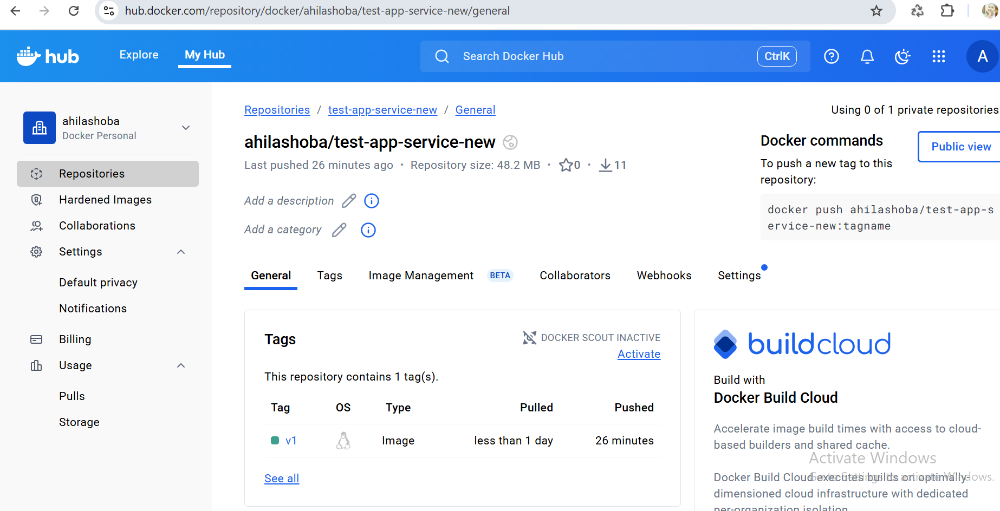

#. Create folder
#. git hub connection
#. npm and node modules installation
#. git ignore added
#. local setup completed
---------------------

#. docker file creation
#. docker image created 
#. container running done
#. docker image pushed into docker hub
#. Helm chart creation for docker images
#. Helm installed with cluster ip 
#. access via browser
-----------------------------
#  docker pull ahilashoba/test-app-service-new
#  Helm chart creation:
   #  Helm chart creation
   #  targetPort: 3001 # The port your application listens on inside the container
   #  helm install appservice-release-1 .
   #  Check deployment, cluster ip service, and access in local browser using echo "Visit http://127.0.0.1:8080 to use your application" 
   #  (or)
   #   using port forward

   #  http://127.0.0.1:3001/appointments   (target port exposed to 3001)
   Output: 
   {
  "message": "Appointments retrieved successfully",
  "count": 2,
  "appointments": [
    {
      "id": "1",
      "patientId": "1",
      "date": "2023-06-15",
      "time": "10:00",
      "doctor": "Dr. Smith"
    },
    {
      "id": "2",
      "patientId": "2",
      "date": "2023-06-16",
      "time": "14:30",
      "doctor": "Dr. Johnson"
    }
  ]
}

